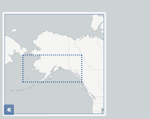
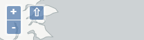
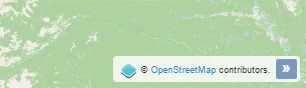

.. _controls:

Controls and tools
==================

Here you can find a description of all the controls and tools that can be added to a web app and how to configure them.

Scale bar
---------

A scale bar to be placed on the bottom left of the map window. This control is enabled by default.

   Scale bar on the map

The following properties can be configured for this control:

.. list-table::
   :header-rows: 1
   :stub-columns: 1
   :widths: 20 80
   :class: non-responsive

   * - Option
     - Description
   * - minWidth
     - Minimum width, in pixels, of the scale bar. Default is 64.
   * - units
     - The units to be used in the scale bar. Options are metric, degrees, imperial, nautical, and us. Default is metric.

.. figure:: img/scalebarconfigure.png

   Scale bar configuration

Zoom Controls
-------------

Buttons to zoom the map in and out. This control is enabled by default.

ADD FIGURE

The following properties can be configured for this control:

.. list-table::
   :header-rows: 1
   :stub-columns: 1
   :widths: 20 80
   :class: non-responsive

   * - Option
     - Description
   * - delta
     - NOT SURE. Default is 1.2.
   * - duration
     - NOT SURE. Default is 250.
   * - zoomInLabel
     - The text to display on the Zoom In button. Default is ``+``.
   * - zoomInTipLabel
     - The text to display when hovering over the Zoom In button. Default is ``Zoom in``.
   * - zoomOutLabel
     - The text to display on the Zoom Out button. Default is ``-``.
   * - zoomOutTipLabel
     - The text to display when hovering over the Zoom Out button. Default is ``Zoom out``.

ADD CON FIGURE

Layers List
-----------

A control with the list of layers in the map. This control is enabled by default.

.. figure:: img/layerslist.png

   Layers list

The following properties can be configured for this control:

.. list-table::
   :header-rows: 1
   :stub-columns: 1
   :widths: 20 80
   :class: non-responsive

   * - Option
     - Description
   * - showOpacity
     - Show opacity slider for each layer.
   * - showZoomTo
     - Show Zoom To button, so the user can adjust the extent of the map based on the extent of an individual layer.
   * - showDownload
     - Show Download button, so the user can download the layer in GeoJSON format (vector layers only).
   * - allowReordering
     - Allows the user to change the rendering order of layers by dragging them.
   * - showGroupContent
     - When a group exists, sets whether to show the individual layers.
   * - tipLabel
     - The tooltip to show when mouse is hovered over the layers list. Default is Layers.

.. figure:: img/configurelayerslist.png

   Layers List configuration

Overview Map
------------

An additional map that shows a larger overview of the extent of the area covered by the app.

   Overview Map

The following properties can be configured for this control:

.. list-table::
   :header-rows: 1
   :stub-columns: 1
   :widths: 20 80
   :class: non-responsive

   * - Option
     - Description
   * - collapsed
     - If checked, the overview map will not be shown when the app is launched. Default is checked.

.. figure:: img/configureoverview.png

   Overview Map configuration

North Arrow
-----------

An arrow that indicates the north direction.

   North Arrow

There are no configurable properties for this control.

Full Screen
-----------

A button to toggle the full screen mode.

ADD FIGURE

There are no configurable properties for this control.

Attribution
-----------

Adds an attribution note on the bottom right of the map.

   Attribution

There are no configurable properties for this control.

Zoom slider
-----------

Adds a slider bar to control the zoom level.

ADD FIGURE

There are no configurable properties for this control.

3D View
-------

Adds a button to toggle 3D mode. MORE DETAILS.

ADD FIGURE

There are no configurable properties for this control.

Home Button
-----------

Adds a button to return to the initial map extent.

   Home button

There are no configurable properties for this control.

Mouse Position
--------------

Adds a control that displays the current coordinates of the mouse as it moves over the map.

.. figure:: img/mouseposition.png

   Mouse Position

The following properties can be configured for this control:

.. list-table::
   :header-rows: 1
   :stub-columns: 1
   :widths: 20 80
   :class: non-responsive

   * - Option
     - Description
   * - coordinateFormat
     - NEED MORE INFO. Default is ``ol.coordinate.createStringXY(4)``.
   * - Projection
     - The CRS to use when determining the units. Default is ``EPSG:4326``. 
   * - undefinedHTML
     - The text to show when the coordinate cannot be computed. Default is ``&nbsp;`` or a blank.

.. figure:: img/configuremouseposition.png

   Mouse Position configuration

Geolocation
-----------

Enable geolocation and uses the current position of the user in the map. MORE DETAILS.

ADD FIGURE

There are no configurable properties for this control.

Measure
-------

Adds area and length measure tools to the map.

   Measure Tools

There are no configurable properties for this tool.

Selection
---------

Adds the ability to select features on the map. MORE DETAILS

.. figure:: img/selectiontools.png

   Selection options in the app

The following properties can be configured for this tool:

.. list-table::
   :header-rows: 1
   :stub-columns: 1
   :widths: 20 80
   :class: non-responsive

   * - Option
     - Description
   * - Select by point and radius
     - DETAILS. Default is checked.
   * - Select by polygon
     - DETAILS. Default is checked.
   * - Select by rectangle
     - DETAILS. Default is checked.
   * - Select single feature
     - DETAILS. Default is checked.

ADD CON FIGURE

Attributes Table
----------------

Add the ability to display a table containing the attributes of the features in a given layer. Features can be selected/deselected clicking on the table rows. Selected features for the layer are shown in a different color.

   Attributes Table

There are no configurable properties for this tool.

Chart tool
----------

Allow for the creation of charts based on selected features of a layer.

ADD FIGURE

The following properties can be configured for this tool:

.. list-table::
   :header-rows: 1
   :stub-columns: 1
   :widths: 20 80
   :class: non-responsive

   * - Option
     - Description
   * - Chart name
     - The title of the chart.
   * - Display mode
     - Defines how the feature attributes will be used to create the chart. The following options are available:

       * **By feature**. An element will be added in the chart for each selected feature, and it will display the values of attributes of the feature. The attributes to display are selected in the *Value fields* field. The attribute used to identify each feature in the chart is selected in the *Category field* field. 
       * **By category**. Selected features will be grouped according to a category, and statistics for each category will be displayed. The attributes to compute statistics are selected in the *Value fields* field. The attribute used to group features into categories is selected in the *Category field* field. The statistic function to use is selected in the *Operation for aggregation* field.
       * **Count by category**. The chart will show the number of features in each category. The attribute used to group features into categories is selected in the *Category field* field.

   * - Layer
     - The layer from which to choose features.
   * - Layer field
     - MORE INFO
   * - Category field
     - MORE INFO
   * - Add/Modify
     - After all the other fields have been populated, this button will add the info to the chart, visible in the right side of the dialog.  
   * - Remove
     - Will remove given info from the chart.

.. figure:: img/configurecharttool.png

   Chart Tool configuration

Geocoding
---------

Adds geocoding functionality to locate geographic places by name.

   Geocoding tool

There are no configurable properties for this tool.

Query
-----

Adds query tools to perform selections in layers. Queries are expressed using the notation accepted by the `Filtrex <https://github.com/joewalnes/filtrex#expressions>`_ library.

   Query tool

There are no configurable properties for this tool.

Bookmarks
---------

Adds the ability to create and retrieve spatial bookmarks. A spatial bookmark consists of a name, an extent and a description.

When this tool is enabled, a :guilabel:`Bookmarks` tab will be created in the app.

ADD FIGURE

The following properties can be configured for this tool:

.. list-table::
   :header-rows: 1
   :stub-columns: 1
   :widths: 20 80
   :class: non-responsive

   * - Option
     - Description
   * - THING
     - THING

.. image:: img/configurebookmarks.png

NEED TO FIX THIS DESCRIPTION BELOW

There are two options for defining bookmarks:

- Using QGIS bookmarks. Click on *Add from QGIS bookmarks* and in the dialog that will appear, select the bookmarks to use from the ones currently stored in the QGIS database. Since those bookmarks do not contain a description, but just name and extent, you should define the description manually, typing it in the *Description* box for each bookmark.

- Using a vector layer. A new bookmark will be added for each feature in the layer, using the bounding box of the feature geometry as the bookmark extent. The name and description of each bookmark will be taken from two attributes in the layer.

.. image:: img/bookmarksfromlayer.png

The *Configuration tab* controls how the bookmarks will be displayed. 

If the *Show as story panel* box is checked, a narrative map will be created, and a panel to browse across bookmarks will be added to the web app.

Otherwise, bookmarks will be shown as menu entries in the navigation bar, under a *Bookmarks* menu.

About panel
-----------

Adds a button which toggles a text panel, usually describing the app.

HOW DIFFERENT FROM HELP?

   About panel

The following properties can be configured for this tool:

.. list-table::
   :header-rows: 1
   :stub-columns: 1
   :widths: 20 80
   :class: non-responsive

   * - Option
     - Description
   * - content
     - The content of the panel. Accepts HTML formatted text. Click :guilabel:`Edit` to open a text editor.
   * - isClosable
     - When enabled, the user can close the panel.
   * - showNavBarLink
     - When enabled, adds a link in the navigation bar to reopen the panel if it is closed.

.. figure:: img/configureabout.png

   About panel configuration  

Export as image
---------------

Adds an option to export the current map view to an image file.

ADD FIGURE

There are no configurable properties for this tool.

Links
-----

Add links to external sites to the navigation bar. Each link is defined with a name (shown in the navigation bar) and a URL.

ADD FIGURE

The following properties can be configured for this tool:

.. list-table::
   :header-rows: 1
   :stub-columns: 1
   :widths: 20 80
   :class: non-responsive

   * - Option
     - Description
   * - Add link
     - Adds a new link
   * - Remove link
     - Removes a link from the list

.. figure:: img/configurelinks.png

   Links configuration

Help
----

Adds a link on the menubar to a help page.

HOW DIFFERENT FROM ABOUT?

ADD FIGURE

The following properties can be configured for this tool:

.. list-table::
   :header-rows: 1
   :stub-columns: 1
   :widths: 20 80
   :class: non-responsive

   * - Option
     - Description
   * - THING
     - THING