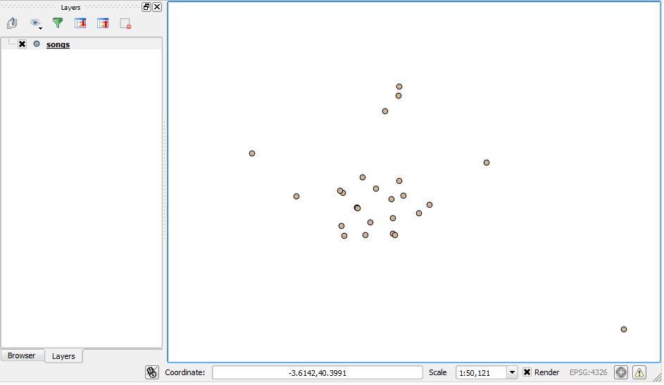
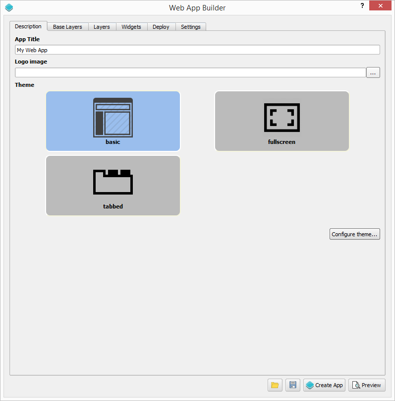
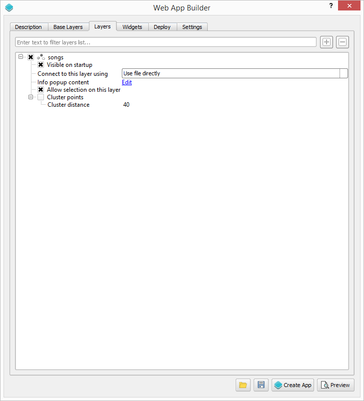
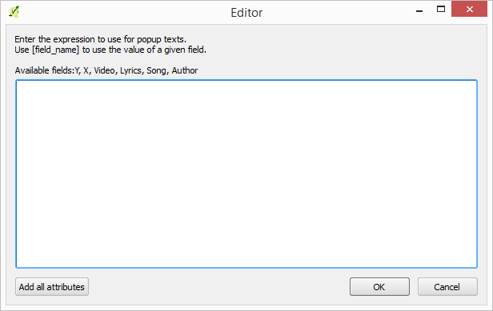
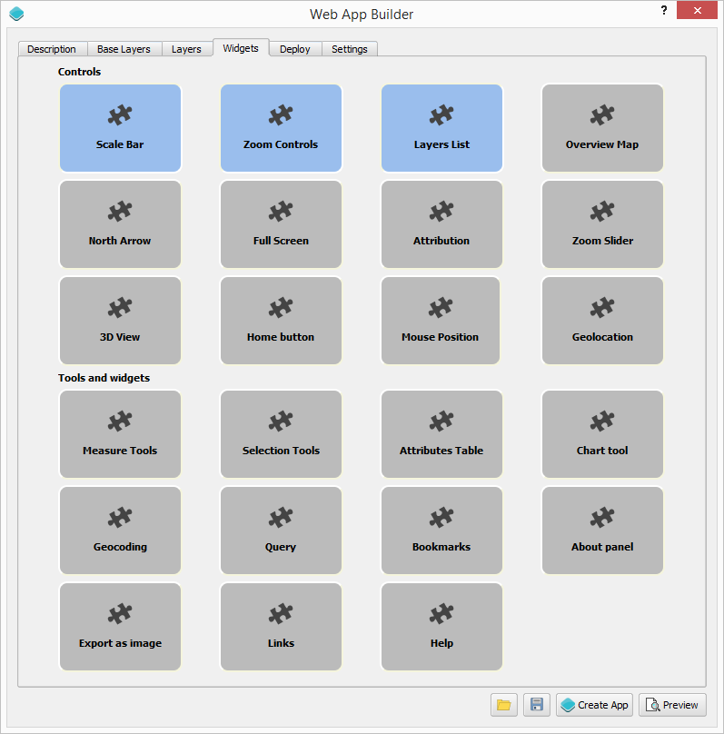
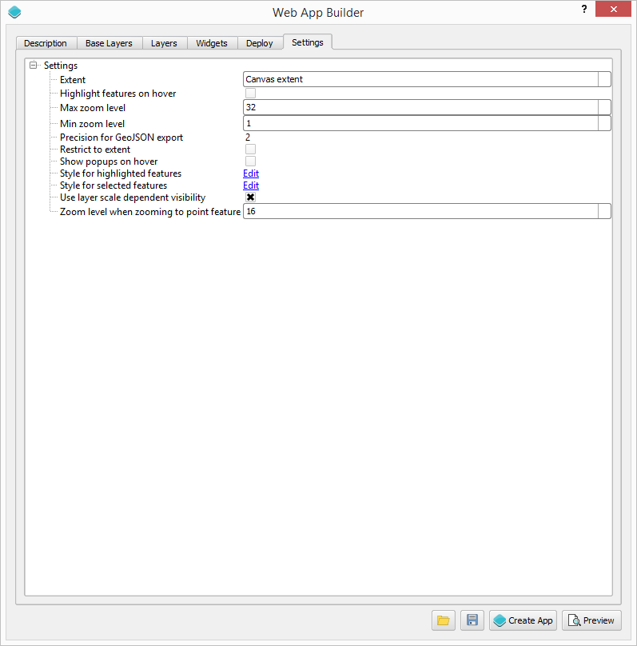
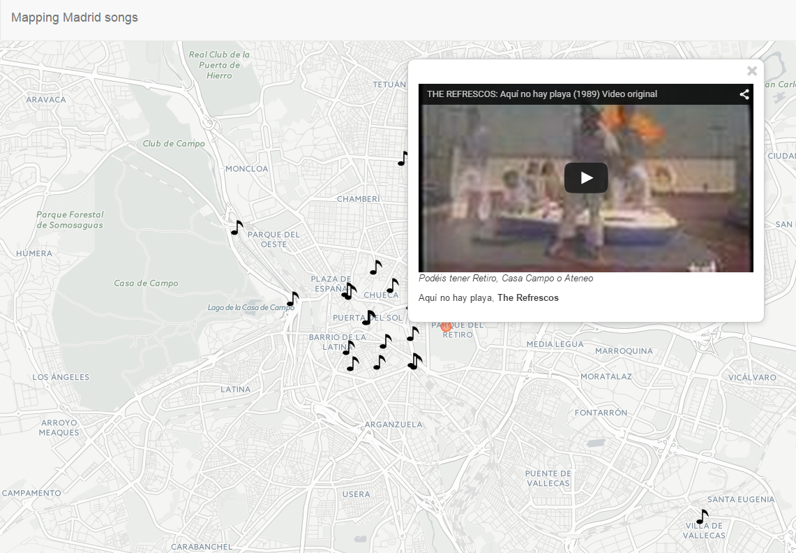

.. _Mapping_songs_about_Madrid:

Mapping songs about Madrid
*************************************

This exercise demonstrate how to create a web app that allow to explore songs related to the city of MAdrid. For each song, an entry is added to a map, which contains information abut the lyrics and the author. A popup is shown when clicking on each song point, with an embeded video for the song. This app is inspired by a similar work published in `this article <http://www.huffingtonpost.es/2015/05/15/canciones-madrid-mapa_n_7214408.html>`_

Data
=====

All data needed for this exercise can be found :download:`here <data/songs.zip>`. There is just a points shapefile with songs information, along with an icon that we will use to render song locations in the map.

Setting up the application in QGIS
===================================

Before we use the Web App Builder plugin, we have to set up our data layers in QGIS. The data that we put in the web app will be exactly as it is in QGIS, including the styling. 

ADd the vector layer that you will find in the data zip file to your QGIS project. 

You can improve the default styling by using a SVG marker with a quaver symbol for each point representing a note. In the data that is used for this exercise, you will find an SVG file that you can use. Check the QGIs user manual to learn how to use a custom SVG symbol.

Defining the web app
=====================

Start the Web App Builder by selecting the *Plugins/Boundless/Web App Builder* menu.

We have several tabs, each one used to define a particular set of parameters. We will go through all of them and describe their meaning.

Description tab
----------------

Enter "Mapping Madrid songs" in the title box. We will not use any icon, so you can leave the logo box empty.

We will use the full screen theme.

Base layer tab
---------------

.. image:: img/baselayer.png
	:align: center

Select the OSM layer as the base layer to use. Since more than one layer can be selected, you will have to unselect the MapQuest layer that is used by default.

Layers tab
-----------

This tab is used to configure which layers from your QGIS project are used, and how they are used. We only have one layer and we will use it, so make sure that the *Songs* layer is checked.

Click on the *Edit...* link to edit the content of the popup for the layer. You will see the following dialog:

Enter the following in the text box, to define the content of the popup:

::

	[Video]

	
<i>[Lyrics]</i>

	
[Song], <b>[Author]</b>

The popup displayed when a song point is selected will contain the embeded video and the song and author information.

Widgets
--------

This tab is used to select which map controls and tools you want in your web app. We do not want any controls, so you should disable the three default ones.

Settings
----------

Some additional parameters can be configured in the last tab of the dialog.

For our web app, we will use all the default values except for the *Show popups on hover* parameter. Check the corresponding box, so popups are shown when passing the mouse over the points, without having to click on them.

Creating the application
=========================

With the web app already defined, we can now create it by clicking on the *Create App* button. A folder selector dialog will be shown. Select the folder where you want to store the web app. The app will be created and saved to the selected folder.

The final result
=========================

If you have done all steps above, you should have a working web app in your machine, in the folder that you selected. Open it by opening the *index.html* file that you will find there.

