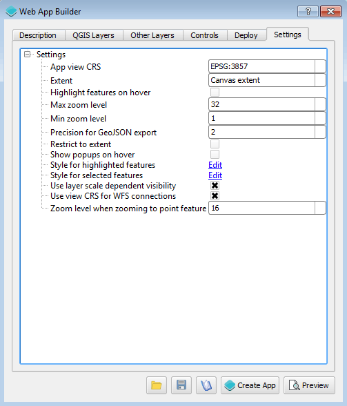

Usage
=====

The Web App Builder is started from the :menuselection:`Plugins --> Boundless --> Web App Builder` menu.

   Menu to launch the Web App Builder

Once launched, the main dialog looks like this:

.. figure:: img/maindialog.png

   Main dialog

**To create a web app, define its characteristics using the tabs in the dialog and then press the Create App button.**

Below is a description of each tab and its contents.

Description
-----------

The elements in the Description tab control the basic structure of the app page.

Set the title of the project in the :guilabel:`App Title` box. In case you want to add a logo along with your title, enter the path to the logo image file in the :guilabel:`Logo image` box.

From the available themes, select the one you want to use for your app. A theme defines how the elements of the web app (map, widgets, menus, etc.) will appear visually.

There are three themes: Basic, Fullscreen, and Tabbed.

Themes have predefined settings, but these can be modified. This is mainly done by modifying the CSS styles that constitute the theme. Clicking the :guilabel:`Configure theme` button will open the dialog shown below:

   Configure theme

Click a category in the list in the upper part of the dialog, and its corresponding CSS will be shown in the lower part. Edit the CSS code and click :guilabel:`OK` to save your changes. 

.. note:: These changes will be saved only for the current project. Subsequent web apps will default to the original CSS.

Base layers
-----------

This tab sets the base layer(s) for your application.

You can select or deselect base layers by clicking the base layer buttons. 

.. figure:: img/baselayers.png

   Base layers tab

Base layers are divided in two groups: Layers and Overlays. Layers contain the usual base data (such as roads and topography). Overlays are additional layers that would server as additional information, all based on available web services, rendered on top of Layers.

.. note:: If you do not want a base layer, you can leave all of them unselected.

Both Layers and Overlays will be added to a group named "Base layers" in the app, which by default is set as the bottom layer.

.. figure:: img/baselayersselector.png

   Base layer selector in a web app

Layers
------

This tab is where you can select the layers from your existing QGIS project that you would like to add to your web app.

.. figure:: img/layers.png

   Layers tab

Every layer in every group in the QGIS project will be listed in this tab. For each layer, there are several options, depending on the type of layer.

* A check box with the name of the layer controls whether the layer will be added to the app or not.
* Another check box controls whether the layer will be visible when the app is loaded.

The following is a description of the different options that you might find for each type of layer, and how the app builder deals with each layer type.

Vector layer
~~~~~~~~~~~~

For each vector layer, the following options are available:

* *Info popup content*. Using this option, you can specify the  content of the popup for features in the layer. Click on the *Edit* link to open the popup editor

  .. figure:: img/popupeditor.png

     Popup editor

  Type the expression to use. For adding the value of a given attribute of the future, enter the attribute name between brackets. Formatting is supported, since the content of the field is assumed to be HTML code and will be treated as such. Images can also be included this way.

* *Connect to this layer using*. Determines how to create the data source that will be used by the app. It has the following options.

  * GeoServer -> WFS: The data will be published to GeoServer and then the app will connect to it as a WFS service. Styling will be done client side by the app itself.

  * GeoServer -> WMS: The data will be published to GeoServer and then the app will connect to it as a WMS service. Styling will be done server side by GeoServer.

  * GeoServer -> PostGIS -> WFS: The data will be imported into PostGIS and then a store will be created in GeoServer to consume that data from the PostGIS database. The app will connect to it as a WFS service. Styling will be done client side by the app itself.

  * GeoServer -> PostGIS -> WMS: The data will be imported into PostGIS and then a store will be created in GeoServer to consume that data from the PostGIS database. The app will connect to it as a WMS service. Styling will be done server side by GeoServer.

  * Use file directly. PostGIS and GeoServer will not be used. The layer will be exported to a GeoJSON file and the app will use it directly. The file will be saved in the output folder in which the app itself will be created.

* *Allow selection on this layer*. If this check box is selected, the user will be able to select the features in this layer using any of the available selection tools (if added to the web app in the *Widgets* section). If you want to create charts based on the features of a given layer, you should allow selection on it.

* Cluster points. Check this option to have your point features clustered. Only available with point geometries.

* Cluster distance. Specify the distance to use for clustering. Only available with point geometries.

Raster layers
~~~~~~~~~~~~~

For each raster layer, the following options are available:

* *Connect to this layer using*. Determines how to create the data source that will be used by the app. It has the following options.

  * GeoServer -> WMS: The layer will be published to GeoServer and then the app will connect to it as a WMS service. Styling will be done server side by GeoServer.

  * Use file directly. PostGIS and GeoServer will not be used. The layer will be exported to an image file and the app will use it directly. The file will be saved in the output folder in which the app itself will be created.

WMS/WFS layers
~~~~~~~~~~~~~~

For WFS and WMS, you will find most of the same options for vector and raster layers, except for the *Connect to this layer using* option. The original service will be used, so no data will be published and the web app will connect to the same service that your QGIS layer is connected to.

Handling projections
~~~~~~~~~~~~~~~~~~~~

All layers will be automatically reprojected into the projection of the map to be created (by default, EPSG:3857) if needed. You can use input layers from any CRS.

Remote services such as WMS or WFS are an exception to this, as they must use the projection used in the web app. If a layer that is based on a remote service is added to the web map and uses a CRS other than the one specified, a warning will be shown and the application will not be created.

Widgets
-------

The Widgets tab allows you to select extra elements that you would like to add to your web app.

.. figure:: img/widgets.png

   Widgets tab

Widgets are divided in two groups:

* **Controls**: OpenLayers controls that act on the map and appear in it. They have the same appearance, regardless of the selected theme.
* **Tools**: Other elements that might or might not be related to the map and its data. Their place in the app and their appearance is controled by the theme.

Some of this elements can be configured, by right-clicking their corresponding button and selecting the :guilabel:`Configure` option in the context menu.

   Configure widget

You can find a detailed description of all available controls and tools in the :ref:`controls` page.

Data deploy
-----------

The Deploy tab is used to specify where your data will be stored. It has two groups: *PostGIS* and *GeoServer*. They are used only if your data configuration uses PostGIS or GeoServer (as explained in the *Layers* section).

   Deploy tab

MORE DETAILS

Settings
--------

The Settings tab shows additional configuration for the application:

   Settings

.. list-table::
   :header-rows: 1
   :stub-columns: 1
   :widths: 20 80
   :class: non-responsive

   * - Setting
     - Description
   * - Extent
     - The extent of the map. There are two options: Canvas extent, which is the current state of the QGIS canvas, or Fit to Layers extent, which will calculate the extent based on the union of all the layers in the project.
   * - Highlight features on hover
     - When selected, SOMETHING WILL HAPPEN.
   * - Max zoom level
     - Maximum zoom level available in the web app. HOW DEFINED!?
   * - Min zoom level
     - Minimum zoom level available in the web app. HOW DEFINED!?
   * - Precision for GeoJSON export
     - How many decimal places to used when exporting features using GeoJSON. Higher numbers increase accuracy but also data size. Default is 2.
   * - Restrict to extent
     - Do not allow the map to be panned outside of the extent.
   * - Show popups on hover
     - MORE INFO
   * - Style for highlighted features
     - Allows you to customize the way that features will look when highlighted. Clicking :guilabel:`Edit` will bring up a box with a CSS style, which can be customized.
   * - Style for selected features
     - Allows you to customize the way that features will look when selected. Clicking :guilabel:`Edit` will bring up a box with a CSS style, which can be customized.
   * - Use layer scale dependent visibility
     - If defined in the QGIS rendering properties, layers will only be visible in the map when they are within the defined scale range.
   * - Zoom level when zooming to point feature
     - If a single feature is selected in the attributes table in the web app, and the :guilabel:`Zoom to selected` button is clicked, the map zoom will be set to this zoom level.

